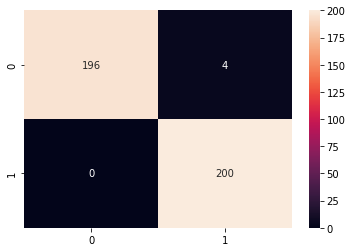

# `deepfeatx`: Deep Learning Feature Extractor of Images using Transfer Learning Models
> Helper for automatic extraction of features from images (and soon text as well) from transfer learning models like ResNet, VGG16 and EfficientNet.


## Install

```
#hide_output
!pip install deepfeatx
```

## Why this project has been created
- Fill the gap between ML and DL thus allowing estimators beyond only neural networks for computer vision and NLP problems
- Neural network models are too painful to setup and train - data generators, optimizers, learning rates, loss functions, training loops, batch size, etc. 
- State of the art results are possible thanks to pretrained models that allows feature extraction
- With this library we can handle those problems as they were traditional machine learning problems
- Possibility of using low-code APIs like `scikit-learn` for computer vision and NLP problems

## Usage
### Extracting features from an image

```
#hide_output
from deepfeatx.image import ImageFeatureExtractor
fe = ImageFeatureExtractor()
```

```
im_url='https://raw.githubusercontent.com/WittmannF/deepfeatx/master/sample_data/cats_vs_dogs/valid/dog/dog.124.jpg'
fe.read_img_url(im_url)
```


```
fe.url_to_vector(im_url)
```

    2021-10-06 11:27:13.679687: I tensorflow/compiler/mlir/mlir_graph_optimization_pass.cc:185] None of the MLIR Optimization Passes are enabled (registered 2)
    2021-10-06 11:27:13.679874: W tensorflow/core/platform/profile_utils/cpu_utils.cc:128] Failed to get CPU frequency: 0 Hz
    2021-10-06 11:27:13.846942: I tensorflow/core/grappler/optimizers/custom_graph_optimizer_registry.cc:112] Plugin optimizer for device_type GPU is enabled.


    array([[0.282272  , 1.0504342 , 0.11333481, ..., 0.18499802, 0.02220213,
            0.06158632]], dtype=float32)


### Extracting Features from a Folder with Images

```
#hide_output
!git clone https://github.com/WittmannF/image-scraper.git
```

```
df=fe.extract_features_from_directory('image-scraper/images/pug',
                                   classes_as_folders=False,
                                   export_vectors_as_df=True)

df.head()
```

    Found 4 validated image filenames.
    1/1 [==============================] - 0s 412ms/step


    2021-10-06 11:27:16.893822: I tensorflow/core/grappler/optimizers/custom_graph_optimizer_registry.cc:112] Plugin optimizer for device_type GPU is enabled.


<div>
<style scoped>
    .dataframe tbody tr th:only-of-type {
        vertical-align: middle;
    }

    .dataframe tbody tr th {
        vertical-align: top;
    }

    .dataframe thead th {
        text-align: right;
    }
</style>
<table border="1" class="dataframe">
  <thead>
    <tr style="text-align: right;">
      <th></th>
      <th>filepaths</th>
      <th>0</th>
      <th>1</th>
      <th>2</th>
      <th>3</th>
      <th>4</th>
      <th>5</th>
      <th>6</th>
      <th>7</th>
      <th>8</th>
      <th>...</th>
      <th>2038</th>
      <th>2039</th>
      <th>2040</th>
      <th>2041</th>
      <th>2042</th>
      <th>2043</th>
      <th>2044</th>
      <th>2045</th>
      <th>2046</th>
      <th>2047</th>
    </tr>
  </thead>
  <tbody>
    <tr>
      <th>0</th>
      <td>image-scraper/images/pug/efd08a2dc5.jpg</td>
      <td>0.030705</td>
      <td>0.042393</td>
      <td>0.422986</td>
      <td>1.316509</td>
      <td>0.020907</td>
      <td>0.000000</td>
      <td>0.081956</td>
      <td>0.404423</td>
      <td>0.489835</td>
      <td>...</td>
      <td>0.013765</td>
      <td>0.642072</td>
      <td>1.818821</td>
      <td>0.299441</td>
      <td>0.000000</td>
      <td>0.419997</td>
      <td>0.200106</td>
      <td>0.179524</td>
      <td>0.026852</td>
      <td>0.079208</td>
    </tr>
    <tr>
      <th>1</th>
      <td>image-scraper/images/pug/24d0f1eee3.jpg</td>
      <td>0.068498</td>
      <td>0.319734</td>
      <td>0.081250</td>
      <td>1.248270</td>
      <td>0.035602</td>
      <td>0.003398</td>
      <td>0.000000</td>
      <td>0.131528</td>
      <td>0.099514</td>
      <td>...</td>
      <td>0.258502</td>
      <td>1.042543</td>
      <td>0.691716</td>
      <td>0.264937</td>
      <td>0.112621</td>
      <td>0.927995</td>
      <td>0.050389</td>
      <td>0.000000</td>
      <td>0.087217</td>
      <td>0.066992</td>
    </tr>
    <tr>
      <th>2</th>
      <td>image-scraper/images/pug/6fb189ce56.jpg</td>
      <td>0.373005</td>
      <td>0.102008</td>
      <td>0.097662</td>
      <td>0.362927</td>
      <td>0.549803</td>
      <td>0.118015</td>
      <td>0.000000</td>
      <td>0.104320</td>
      <td>0.102526</td>
      <td>...</td>
      <td>0.210635</td>
      <td>0.213147</td>
      <td>0.013510</td>
      <td>0.574433</td>
      <td>0.017234</td>
      <td>0.628009</td>
      <td>0.000000</td>
      <td>0.184550</td>
      <td>0.000000</td>
      <td>0.248099</td>
    </tr>
    <tr>
      <th>3</th>
      <td>image-scraper/images/pug/ee815ebc87.jpg</td>
      <td>0.263904</td>
      <td>0.430294</td>
      <td>0.391808</td>
      <td>0.033076</td>
      <td>0.200174</td>
      <td>0.019310</td>
      <td>0.002792</td>
      <td>0.129120</td>
      <td>0.050257</td>
      <td>...</td>
      <td>0.048244</td>
      <td>0.147806</td>
      <td>1.430154</td>
      <td>0.266686</td>
      <td>0.005126</td>
      <td>0.158225</td>
      <td>0.097526</td>
      <td>0.005045</td>
      <td>0.060016</td>
      <td>1.109626</td>
    </tr>
  </tbody>
</table>
<p>4 rows × 2049 columns</p>
</div>


### Extracting Features from a directory having one sub-folder per class

If the directory structure is the following:
```
main_directory/
...class_a/
......a_image_1.jpg
......a_image_2.jpg
...class_b/
......b_image_1.jpg
......b_image_2.jpg
```
We can enter `main_directory` as input by changing `classes_as_folders` as True:

```
df=fe.extract_features_from_directory('image-scraper/images/',
                                      classes_as_folders=True,
                                      export_vectors_as_df=True,
                                      export_class_names=True)

df.head()
```

    Found 504 images belonging to 6 classes.


    2021-10-06 11:27:22.669056: I tensorflow/core/grappler/optimizers/custom_graph_optimizer_registry.cc:112] Plugin optimizer for device_type GPU is enabled.


    16/16 [==============================] - 6s 358ms/step


<div>
<style scoped>
    .dataframe tbody tr th:only-of-type {
        vertical-align: middle;
    }

    .dataframe tbody tr th {
        vertical-align: top;
    }

    .dataframe thead th {
        text-align: right;
    }
</style>
<table border="1" class="dataframe">
  <thead>
    <tr style="text-align: right;">
      <th></th>
      <th>filepaths</th>
      <th>classes</th>
      <th>0</th>
      <th>1</th>
      <th>2</th>
      <th>3</th>
      <th>4</th>
      <th>5</th>
      <th>6</th>
      <th>7</th>
      <th>...</th>
      <th>2038</th>
      <th>2039</th>
      <th>2040</th>
      <th>2041</th>
      <th>2042</th>
      <th>2043</th>
      <th>2044</th>
      <th>2045</th>
      <th>2046</th>
      <th>2047</th>
    </tr>
  </thead>
  <tbody>
    <tr>
      <th>0</th>
      <td>image-scraper/images/chihuahua/00dcf98689.jpg</td>
      <td>chihuahua</td>
      <td>0.640897</td>
      <td>0.887126</td>
      <td>0.017012</td>
      <td>0.723459</td>
      <td>0.164907</td>
      <td>0.010150</td>
      <td>0.042344</td>
      <td>0.987457</td>
      <td>...</td>
      <td>0.289271</td>
      <td>0.182086</td>
      <td>0.638064</td>
      <td>0.092432</td>
      <td>0.212789</td>
      <td>0.077480</td>
      <td>0.255031</td>
      <td>0.006371</td>
      <td>0.489620</td>
      <td>0.028672</td>
    </tr>
    <tr>
      <th>1</th>
      <td>image-scraper/images/chihuahua/01ee02c2fb.jpg</td>
      <td>chihuahua</td>
      <td>0.357992</td>
      <td>0.128552</td>
      <td>0.227736</td>
      <td>0.652588</td>
      <td>0.014283</td>
      <td>0.092680</td>
      <td>0.049545</td>
      <td>0.319637</td>
      <td>...</td>
      <td>0.061090</td>
      <td>0.526585</td>
      <td>2.363337</td>
      <td>0.160859</td>
      <td>0.000000</td>
      <td>0.008739</td>
      <td>0.401081</td>
      <td>1.377398</td>
      <td>0.383465</td>
      <td>0.434211</td>
    </tr>
    <tr>
      <th>2</th>
      <td>image-scraper/images/chihuahua/040df01fb4.jpg</td>
      <td>chihuahua</td>
      <td>0.163308</td>
      <td>0.383921</td>
      <td>0.029490</td>
      <td>0.985443</td>
      <td>0.866045</td>
      <td>0.098337</td>
      <td>0.000000</td>
      <td>0.634062</td>
      <td>...</td>
      <td>0.188044</td>
      <td>0.000000</td>
      <td>0.056569</td>
      <td>1.115319</td>
      <td>0.000000</td>
      <td>0.005084</td>
      <td>0.072280</td>
      <td>0.555855</td>
      <td>0.333000</td>
      <td>0.413303</td>
    </tr>
    <tr>
      <th>3</th>
      <td>image-scraper/images/chihuahua/04d8487a97.jpg</td>
      <td>chihuahua</td>
      <td>0.206927</td>
      <td>3.128521</td>
      <td>0.147507</td>
      <td>0.104669</td>
      <td>0.554029</td>
      <td>2.415109</td>
      <td>0.009964</td>
      <td>0.171642</td>
      <td>...</td>
      <td>0.000000</td>
      <td>1.297839</td>
      <td>1.165449</td>
      <td>0.562891</td>
      <td>0.000000</td>
      <td>0.395750</td>
      <td>0.250796</td>
      <td>0.295067</td>
      <td>0.534072</td>
      <td>0.051334</td>
    </tr>
    <tr>
      <th>4</th>
      <td>image-scraper/images/chihuahua/0d9fa44dea.jpg</td>
      <td>chihuahua</td>
      <td>0.233232</td>
      <td>0.355028</td>
      <td>0.453336</td>
      <td>0.060354</td>
      <td>0.479405</td>
      <td>0.000000</td>
      <td>0.099390</td>
      <td>0.223719</td>
      <td>...</td>
      <td>0.308505</td>
      <td>0.376597</td>
      <td>1.075250</td>
      <td>0.416980</td>
      <td>0.073678</td>
      <td>0.316829</td>
      <td>0.620357</td>
      <td>0.125714</td>
      <td>0.179848</td>
      <td>0.110405</td>
    </tr>
  </tbody>
</table>
<p>5 rows × 2050 columns</p>
</div>


The usage of `export_class_names=True` will add a new column to the dataframe with the classes names.

## Examples
### Cats vs Dogs using Keras vs `deepfeatx`
First let's compare the code of one of the simplest deep learning libraries (Keras) with `deepfeatx`. As example, let's use a subset of Cats vs Dogs:

```
#hide_output
from deepfeatx.image import download_dataset
download_dataset('https://github.com/dl7days/datasets/raw/master/cats-dogs-data.zip', 'cats-dogs-data.zip')
```

Here's the keras implementation for a great performance result:

```
from tensorflow.keras.models import Sequential
from tensorflow.keras.layers import Flatten, Dense, GlobalAveragePooling2D
from tensorflow.keras.applications.resnet50 import ResNet50, preprocess_input
from tensorflow.keras.preprocessing.image import ImageDataGenerator
from tensorflow.keras.optimizers import Adam

TARGET_SHAPE = (224, 224, 3)
TRAIN_PATH = 'cats-dogs-data/train'
VALID_PATH = 'cats-dogs-data/valid'

datagen = ImageDataGenerator(preprocessing_function=preprocess_input)
train_gen = datagen.flow_from_directory(TRAIN_PATH, 
                                        target_size=TARGET_SHAPE[:2], 
                                        class_mode='sparse')
valid_gen = datagen.flow_from_directory(VALID_PATH, 
                                        target_size=TARGET_SHAPE[:2], 
                                        class_mode='sparse',
                                        shuffle=False)

base_model = ResNet50(include_top=False, input_shape=TARGET_SHAPE)

for layer in base_model.layers:
    layer.trainable=False
    
model = Sequential([base_model,
                    GlobalAveragePooling2D(),
                    Dense(1024, activation='relu'),
                    Dense(2, activation='softmax')])
```

    Found 2000 images belonging to 2 classes.
    Found 400 images belonging to 2 classes.


```
model.compile(optimizer=Adam(learning_rate=1e-4), loss='sparse_categorical_crossentropy', metrics=['accuracy'])
```

```
model.fit(train_gen, epochs=3, validation_data=valid_gen)
```

    Epoch 1/3


    2021-10-06 11:29:26.088412: I tensorflow/core/grappler/optimizers/custom_graph_optimizer_registry.cc:112] Plugin optimizer for device_type GPU is enabled.
    2021-10-06 11:29:26.256 python[95381:1139332] -[MPSGraph adamUpdateWithLearningRateTensor:beta1Tensor:beta2Tensor:epsilonTensor:beta1PowerTensor:beta2PowerTensor:valuesTensor:momentumTensor:velocityTensor:maximumVelocityTensor:gradientTensor:name:]: unrecognized selector sent to instance 0x2a93793b0


By looking at `val_accuracy` we can confirm the results seems great. Let's also plot some other metrics:

```
from sklearn.metrics import roc_auc_score, classification_report, confusion_matrix
import seaborn as sns
y_pred = model.predict(valid_gen)
y_test = valid_gen.classes
roc = roc_auc_score(y_test, y_pred[:, 1])
print("ROC AUC Score", roc)
```

    ROC AUC Score 0.9989


```
cm=confusion_matrix(y_test, y_pred.argmax(axis=1))
sns.heatmap(cm, annot=True, fmt='g')
```


    <matplotlib.axes._subplots.AxesSubplot at 0x7fcc41c57090>


Although we got an almost perfect clssifier, there are multiple details that someone who is coming from sklearn has to be careful when using Keras, for example:
- Correctly setup the Data Generator
- Fine tune the learning rate
- Adjust the batch size

Now let's replicate the same results using `deepfeatx`:

```
from deepfeatx.image import ImageFeatureExtractor
from sklearn.linear_model import LogisticRegression

TRAIN_PATH = 'cats-dogs-data/train'
VALID_PATH = 'cats-dogs-data/valid'

fe = ImageFeatureExtractor()

train=fe.extract_features_from_directory(TRAIN_PATH, 
                                         classes_as_folders=True,
                                         export_class_names=True)
test=fe.extract_features_from_directory(VALID_PATH, 
                                         classes_as_folders=True,
                                         export_class_names=True)

X_train, y_train = train.drop(['filepaths', 'classes'], axis=1), train['classes']
X_test, y_test = test.drop(['filepaths', 'classes'], axis=1), test['classes']
lr = LogisticRegression().fit(X_train, y_train)
```

    Found 2000 images belonging to 2 classes.


    2021-10-06 11:27:40.528937: I tensorflow/core/grappler/optimizers/custom_graph_optimizer_registry.cc:112] Plugin optimizer for device_type GPU is enabled.


    63/63 [==============================] - 22s 350ms/step
    Found 400 images belonging to 2 classes.
    13/13 [==============================] - 4s 351ms/step


    /Users/wittmann/miniforge3/envs/mlp/lib/python3.8/site-packages/sklearn/linear_model/_logistic.py:814: ConvergenceWarning: lbfgs failed to converge (status=1):
    STOP: TOTAL NO. of ITERATIONS REACHED LIMIT.
    
    Increase the number of iterations (max_iter) or scale the data as shown in:
        https://scikit-learn.org/stable/modules/preprocessing.html
    Please also refer to the documentation for alternative solver options:
        https://scikit-learn.org/stable/modules/linear_model.html#logistic-regression
      n_iter_i = _check_optimize_result(


```
roc_auc_score(y_test, lr.predict_proba(X_test)[:, 1])
```


    0.9996


```
import seaborn as sns
cm=confusion_matrix(y_test, lr.predict(X_test))
sns.heatmap(cm, annot=True, fmt='g')
```


    <AxesSubplot:>





Even though the code is smaller, is still as powerful as the keras code and also very flexible. The most important part is the feature extraction, which `deepfeatx` take care for us, and the rest can be performed as any other ML problem.
