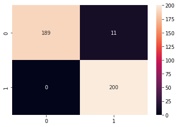

# `deepfeatx`: Deep Learning Feature Extractor of Images using Transfer Learning Models
> Helper for automatic extraction of features from images (and soon text as well) from transfer learning models like ResNet, VGG16 and EfficientNet.


## Install

```
#hide_output
!pip install deepfeatx
```

## Why this project has been created
- Fill the gap between ML and DL thus allowing estimators beyond only neural networks for computer vision and NLP problems
- Neural network models are too painful to setup and train - data generators, optimizers, learning rates, loss functions, training loops, batch size, etc. 
- State of the art results are possible thanks to pretrained models that allows feature extraction
- With this library we can handle those problems as they were traditional machine learning problems
- Possibility of using low-code APIs like `scikit-learn` for computer vision and NLP problems

## Usage
### Extracting features from an image

`deepfeatx` allows extracting features from the models 'efficientnetb0', 'efficientnetb4', 'efficientnetb7' and 'resnet50'. As default we are using Resnet50 but you can also specify different models as the class input:

```
#hide_output
from deepfeatx.image import ImageFeatureExtractor
fe = ImageFeatureExtractor('efficientnetb4')
```

Next, let's transform the following URL into a vector:

```
im_url='https://raw.githubusercontent.com/WittmannF/deepfeatx/master/sample_data/cats_vs_dogs/valid/dog/dog.124.jpg'
fe.read_img_url(im_url)
```


```
fe.url_to_vector(im_url)
```


    array([[-0.19569655,  0.01385073, -0.18466987, ..., -0.18626775,
             0.24537565,  0.03650745]], dtype=float32)


### Extracting Features from a Folder with Images

```
#hide_output
!git clone https://github.com/WittmannF/image-scraper.git
```

```
df=fe.extract_features_from_directory('image-scraper/images/pug',
                                   classes_as_folders=False,
                                   export_vectors_as_df=True)

df.head()
```

    Found 4 validated image filenames.
    1/1 [==============================] - 0s 89ms/step


<div>
<style scoped>
    .dataframe tbody tr th:only-of-type {
        vertical-align: middle;
    }

    .dataframe tbody tr th {
        vertical-align: top;
    }

    .dataframe thead th {
        text-align: right;
    }
</style>
<table border="1" class="dataframe">
  <thead>
    <tr style="text-align: right;">
      <th></th>
      <th>filepaths</th>
      <th>0</th>
      <th>1</th>
      <th>2</th>
      <th>3</th>
      <th>4</th>
      <th>5</th>
      <th>6</th>
      <th>7</th>
      <th>8</th>
      <th>...</th>
      <th>1782</th>
      <th>1783</th>
      <th>1784</th>
      <th>1785</th>
      <th>1786</th>
      <th>1787</th>
      <th>1788</th>
      <th>1789</th>
      <th>1790</th>
      <th>1791</th>
    </tr>
  </thead>
  <tbody>
    <tr>
      <th>0</th>
      <td>image-scraper/images/pug/efd08a2dc5.jpg</td>
      <td>-0.053781</td>
      <td>-0.201073</td>
      <td>-0.109230</td>
      <td>0.032315</td>
      <td>-0.154896</td>
      <td>-0.163725</td>
      <td>-0.233414</td>
      <td>-0.199399</td>
      <td>-0.207240</td>
      <td>...</td>
      <td>-0.184487</td>
      <td>-0.191406</td>
      <td>-0.158955</td>
      <td>0.106836</td>
      <td>0.073545</td>
      <td>0.519778</td>
      <td>-0.221428</td>
      <td>-0.187045</td>
      <td>-0.086689</td>
      <td>-0.228142</td>
    </tr>
    <tr>
      <th>1</th>
      <td>image-scraper/images/pug/24d0f1eee3.jpg</td>
      <td>-0.179735</td>
      <td>-0.149042</td>
      <td>-0.099841</td>
      <td>-0.043361</td>
      <td>-0.176758</td>
      <td>-0.191918</td>
      <td>-0.232161</td>
      <td>-0.136291</td>
      <td>-0.212060</td>
      <td>...</td>
      <td>-0.075074</td>
      <td>-0.171430</td>
      <td>-0.185827</td>
      <td>0.104012</td>
      <td>-0.179634</td>
      <td>0.252138</td>
      <td>-0.235885</td>
      <td>-0.064212</td>
      <td>-0.009336</td>
      <td>-0.150108</td>
    </tr>
    <tr>
      <th>2</th>
      <td>image-scraper/images/pug/6fb189ce56.jpg</td>
      <td>-0.188432</td>
      <td>-0.128387</td>
      <td>-0.153920</td>
      <td>0.126379</td>
      <td>-0.090949</td>
      <td>-0.178837</td>
      <td>-0.169744</td>
      <td>-0.131994</td>
      <td>-0.176617</td>
      <td>...</td>
      <td>0.470620</td>
      <td>-0.133934</td>
      <td>0.057369</td>
      <td>0.198847</td>
      <td>1.394713</td>
      <td>-0.043932</td>
      <td>-0.185945</td>
      <td>-0.094914</td>
      <td>-0.144376</td>
      <td>0.320053</td>
    </tr>
    <tr>
      <th>3</th>
      <td>image-scraper/images/pug/ee815ebc87.jpg</td>
      <td>-0.108604</td>
      <td>-0.076769</td>
      <td>-0.191977</td>
      <td>-0.003384</td>
      <td>-0.160474</td>
      <td>-0.008317</td>
      <td>-0.222178</td>
      <td>-0.157181</td>
      <td>-0.205097</td>
      <td>...</td>
      <td>0.162647</td>
      <td>-0.003036</td>
      <td>-0.095424</td>
      <td>0.039418</td>
      <td>-0.083985</td>
      <td>0.276322</td>
      <td>-0.185036</td>
      <td>-0.169026</td>
      <td>0.432216</td>
      <td>0.229381</td>
    </tr>
  </tbody>
</table>
<p>4 rows × 1793 columns</p>
</div>


### Extracting Features from a directory having one sub-folder per class

If the directory structure is the following:
```
main_directory/
...class_a/
......a_image_1.jpg
......a_image_2.jpg
...class_b/
......b_image_1.jpg
......b_image_2.jpg
```
We can enter `main_directory` as input by changing `classes_as_folders` as True:

```
df=fe.extract_features_from_directory('image-scraper/images/',
                                      classes_as_folders=True,
                                      export_vectors_as_df=True,
                                      export_class_names=True)

df.head()
```

    Found 504 images belonging to 6 classes.
    16/16 [==============================] - 9s 565ms/step


<div>
<style scoped>
    .dataframe tbody tr th:only-of-type {
        vertical-align: middle;
    }

    .dataframe tbody tr th {
        vertical-align: top;
    }

    .dataframe thead th {
        text-align: right;
    }
</style>
<table border="1" class="dataframe">
  <thead>
    <tr style="text-align: right;">
      <th></th>
      <th>filepaths</th>
      <th>classes</th>
      <th>0</th>
      <th>1</th>
      <th>2</th>
      <th>3</th>
      <th>4</th>
      <th>5</th>
      <th>6</th>
      <th>7</th>
      <th>...</th>
      <th>1782</th>
      <th>1783</th>
      <th>1784</th>
      <th>1785</th>
      <th>1786</th>
      <th>1787</th>
      <th>1788</th>
      <th>1789</th>
      <th>1790</th>
      <th>1791</th>
    </tr>
  </thead>
  <tbody>
    <tr>
      <th>0</th>
      <td>image-scraper/images/chihuahua/00dcf98689.jpg</td>
      <td>chihuahua</td>
      <td>-0.159810</td>
      <td>-0.143636</td>
      <td>-0.163834</td>
      <td>-0.189329</td>
      <td>-0.221989</td>
      <td>-0.205568</td>
      <td>-0.032348</td>
      <td>-0.196095</td>
      <td>...</td>
      <td>0.187660</td>
      <td>0.382510</td>
      <td>-0.098162</td>
      <td>-0.184861</td>
      <td>0.262455</td>
      <td>0.031863</td>
      <td>-0.142880</td>
      <td>-0.176995</td>
      <td>-0.137101</td>
      <td>-0.197719</td>
    </tr>
    <tr>
      <th>1</th>
      <td>image-scraper/images/chihuahua/01ee02c2fb.jpg</td>
      <td>chihuahua</td>
      <td>-0.115785</td>
      <td>-0.178243</td>
      <td>-0.154352</td>
      <td>-0.074939</td>
      <td>-0.182898</td>
      <td>-0.234842</td>
      <td>0.201118</td>
      <td>-0.172307</td>
      <td>...</td>
      <td>0.096958</td>
      <td>-0.147701</td>
      <td>-0.117756</td>
      <td>-0.172870</td>
      <td>0.753768</td>
      <td>-0.196702</td>
      <td>-0.142921</td>
      <td>-0.159372</td>
      <td>-0.219529</td>
      <td>-0.172731</td>
    </tr>
    <tr>
      <th>2</th>
      <td>image-scraper/images/chihuahua/040df01fb4.jpg</td>
      <td>chihuahua</td>
      <td>-0.224309</td>
      <td>-0.140264</td>
      <td>-0.221784</td>
      <td>0.082428</td>
      <td>0.034317</td>
      <td>-0.244586</td>
      <td>-0.143733</td>
      <td>-0.217184</td>
      <td>...</td>
      <td>0.113856</td>
      <td>-0.015320</td>
      <td>0.485527</td>
      <td>0.115924</td>
      <td>0.359226</td>
      <td>0.059734</td>
      <td>0.705865</td>
      <td>-0.108514</td>
      <td>-0.211965</td>
      <td>-0.201553</td>
    </tr>
    <tr>
      <th>3</th>
      <td>image-scraper/images/chihuahua/04d8487a97.jpg</td>
      <td>chihuahua</td>
      <td>0.357453</td>
      <td>0.228814</td>
      <td>-0.130092</td>
      <td>0.076011</td>
      <td>-0.097715</td>
      <td>0.076276</td>
      <td>0.280204</td>
      <td>-0.187367</td>
      <td>...</td>
      <td>0.510490</td>
      <td>-0.069560</td>
      <td>0.060880</td>
      <td>-0.190473</td>
      <td>-0.038110</td>
      <td>-0.168990</td>
      <td>-0.210013</td>
      <td>-0.141430</td>
      <td>-0.176050</td>
      <td>0.030997</td>
    </tr>
    <tr>
      <th>4</th>
      <td>image-scraper/images/chihuahua/0d9fa44dea.jpg</td>
      <td>chihuahua</td>
      <td>-0.053391</td>
      <td>-0.073038</td>
      <td>-0.131840</td>
      <td>-0.125724</td>
      <td>-0.090771</td>
      <td>-0.176459</td>
      <td>0.088454</td>
      <td>-0.138470</td>
      <td>...</td>
      <td>0.297104</td>
      <td>0.212539</td>
      <td>-0.039888</td>
      <td>-0.214346</td>
      <td>-0.026465</td>
      <td>0.059569</td>
      <td>-0.172730</td>
      <td>-0.144529</td>
      <td>0.012751</td>
      <td>-0.211402</td>
    </tr>
  </tbody>
</table>
<p>5 rows × 1794 columns</p>
</div>


The usage of `export_class_names=True` will add a new column to the dataframe with the classes names.

## Examples
### Cats vs Dogs using Keras vs `deepfeatx`
First let's compare the code of one of the simplest deep learning libraries (Keras) with `deepfeatx`. As example, let's use a subset of Cats vs Dogs:

```
#hide_output
from deepfeatx.image import download_dataset
download_dataset('https://github.com/dl7days/datasets/raw/master/cats-dogs-data.zip', 'cats-dogs-data.zip')
```

Here's the keras implementation for a great performance result:

```
from tensorflow.keras.models import Sequential
from tensorflow.keras.layers import Flatten, Dense, GlobalAveragePooling2D
from tensorflow.keras.applications.resnet50 import ResNet50, preprocess_input
from tensorflow.keras.preprocessing.image import ImageDataGenerator

TARGET_SHAPE = (224, 224, 3)
TRAIN_PATH = 'cats-dogs-data/train'
VALID_PATH = 'cats-dogs-data/valid'

datagen = ImageDataGenerator(preprocessing_function=preprocess_input)
train_gen = datagen.flow_from_directory(TRAIN_PATH, 
                                        target_size=TARGET_SHAPE[:2], 
                                        class_mode='sparse')
valid_gen = datagen.flow_from_directory(VALID_PATH, 
                                        target_size=TARGET_SHAPE[:2], 
                                        class_mode='sparse',
                                        shuffle=False)

base_model = ResNet50(include_top=False, input_shape=TARGET_SHAPE)

for layer in base_model.layers:
    layer.trainable=False
    
model = Sequential([base_model,
                    GlobalAveragePooling2D(),
                    Dense(1024, activation='relu'),
                    Dense(2, activation='softmax')])
```

    Found 2000 images belonging to 2 classes.
    Found 400 images belonging to 2 classes.


```
model.compile(loss='sparse_categorical_crossentropy', 
              metrics=['accuracy'])
```

```
model.fit(train_gen, epochs=3, validation_data=valid_gen)
```

    Epoch 1/3


    2021-10-09 13:35:09.882000: I tensorflow/core/grappler/optimizers/custom_graph_optimizer_registry.cc:112] Plugin optimizer for device_type GPU is enabled.


    63/63 [==============================] - ETA: 0s - loss: 0.5989 - accuracy: 0.9355

    2021-10-09 13:35:33.430145: I tensorflow/core/grappler/optimizers/custom_graph_optimizer_registry.cc:112] Plugin optimizer for device_type GPU is enabled.


    63/63 [==============================] - 29s 435ms/step - loss: 0.5989 - accuracy: 0.9355 - val_loss: 0.1222 - val_accuracy: 0.9750
    Epoch 2/3
    63/63 [==============================] - 28s 438ms/step - loss: 0.1239 - accuracy: 0.9695 - val_loss: 0.0506 - val_accuracy: 0.9900
    Epoch 3/3
    63/63 [==============================] - 27s 425ms/step - loss: 0.0941 - accuracy: 0.9795 - val_loss: 0.2257 - val_accuracy: 0.9725


    <keras.callbacks.History at 0x16ffce0a0>


By looking at `val_accuracy` we can confirm the results seems great. Let's also plot some other metrics:

```
from sklearn.metrics import roc_auc_score, classification_report, confusion_matrix
import seaborn as sns
y_pred = model.predict(valid_gen)
y_test = valid_gen.classes
roc = roc_auc_score(y_test, y_pred[:, 1])
print("ROC AUC Score", roc)
```

    2021-10-09 13:36:39.564183: I tensorflow/core/grappler/optimizers/custom_graph_optimizer_registry.cc:112] Plugin optimizer for device_type GPU is enabled.


    ROC AUC Score 0.99475


```
cm=confusion_matrix(y_test, y_pred.argmax(axis=1))
sns.heatmap(cm, annot=True, fmt='g')
```


    <AxesSubplot:>





Although we got an almost perfect clssifier, there are multiple details that someone who is coming from sklearn has to be careful when using Keras, for example:
- Correctly setup the Data Generator
- Select the optimizer and a learning rate
- Adjust the batch size

Now let's replicate the same results using `deepfeatx`:

```
from deepfeatx.image import ImageFeatureExtractor
from sklearn.linear_model import LogisticRegression

TRAIN_PATH = 'cats-dogs-data/train'
VALID_PATH = 'cats-dogs-data/valid'

fe = ImageFeatureExtractor()

train=fe.extract_features_from_directory(TRAIN_PATH, 
                                         classes_as_folders=True,
                                         export_class_names=True)
test=fe.extract_features_from_directory(VALID_PATH, 
                                         classes_as_folders=True,
                                         export_class_names=True)

X_train, y_train = train.drop(['filepaths', 'classes'], axis=1), train['classes']
X_test, y_test = test.drop(['filepaths', 'classes'], axis=1), test['classes']
lr = LogisticRegression().fit(X_train, y_train)
```

    Found 2000 images belonging to 2 classes.


    2021-10-09 13:37:10.903967: I tensorflow/core/grappler/optimizers/custom_graph_optimizer_registry.cc:112] Plugin optimizer for device_type GPU is enabled.


    63/63 [==============================] - 22s 353ms/step
    Found 400 images belonging to 2 classes.
    13/13 [==============================] - 4s 354ms/step


    /Users/wittmann/miniforge3/envs/mlp/lib/python3.8/site-packages/sklearn/linear_model/_logistic.py:814: ConvergenceWarning: lbfgs failed to converge (status=1):
    STOP: TOTAL NO. of ITERATIONS REACHED LIMIT.
    
    Increase the number of iterations (max_iter) or scale the data as shown in:
        https://scikit-learn.org/stable/modules/preprocessing.html
    Please also refer to the documentation for alternative solver options:
        https://scikit-learn.org/stable/modules/linear_model.html#logistic-regression
      n_iter_i = _check_optimize_result(


```
roc_auc_score(y_test, lr.predict_proba(X_test)[:, 1])
```


    0.9996


```
import seaborn as sns
cm=confusion_matrix(y_test, lr.predict(X_test))
sns.heatmap(cm, annot=True, fmt='g')
```


    <AxesSubplot:>


Even though the code is smaller, is still as powerful as the keras code and also very flexible. The most important part is the feature extraction, which `deepfeatx` take care for us, and the rest can be performed as any other ML problem.
